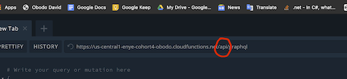

## Links to project resources
- Live site: https://enye-cohort4-obodo.firebaseapp.com/auth
- Front End Github Repo: https://github.com/obododavid/enye-challenge-obodo
- Back End Github Repo: https://github.com/obododavid/enye-challenge-obodo-backend
- Graphql Playground: https://us-central1-enye-cohort4-obodo.cloudfunctions.net/api/graphql

  NOTE: When examining the playground, browsers often remove the "api/" string from the graphql playground url. If it so happens, please examine the playground url (not the browser url) and insert "api/" string in its proper position in order for it to work.
  
  

## Recommended scripts for running project locally
In the project directory, you can run:

### `yarn start`

Runs the app in the development mode. 
Open [http://localhost:3000](http://localhost:3000) to view it in the browser.

### `yarn test`

Launches the test runner in the interactive watch mode. 
See available tests in the next section

## Available Tests

### `SignUp Form Test`

1. Test that input fields change on user input

### `Login Form Test`

1. Test that input fields change on user input
